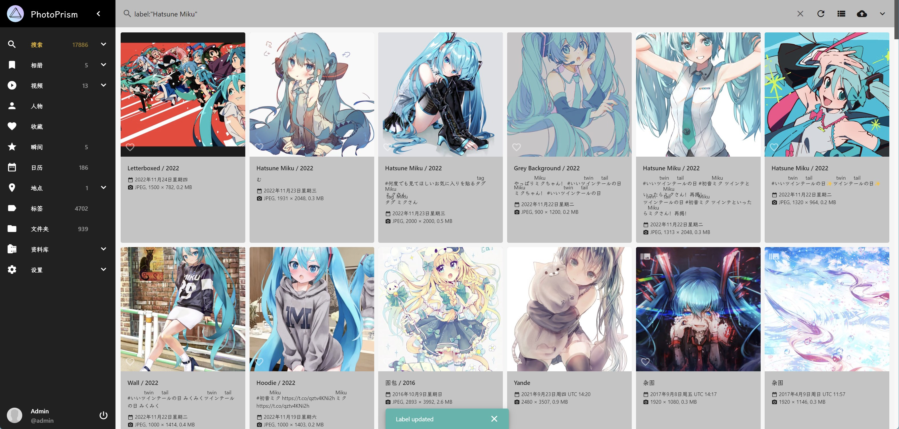

# add-deepdanbooru-tags-to-photoprism

使用[DeepDanbooru](https://github.com/KichangKim/DeepDanbooru)提取[PhotoPrism](https://github.com/photoprism/photoprism)图像的 tags ，并写入到「Label/标签」/保存到本地

## 使用

1. 准备环境
    ```shell
    conda create -n adttp python=3.7
    conda install --yes --file requirements.txt -n adttp
    conda activate adttp
    pip install tensorflow_io
    ```

2. 下载本项目源码，修改`config.template.py`为`config.py`，修改配置：

   MODEL_FILE: 模型文件路径，绝对路径或相对于本项目路径，文件请自行获取

   TAGS_FILE：标签文件路径，绝对路径或相对于本项目路径，文件请自行获取

   PHOTOPRISM：photoprism网址、账号、密码

   FILE_PATH：文件路径是系统上的完整路径，由`FILE_PATH`和photoprism上显示的文件属性-文件名组成，不是photoprism索引界面路径。Windows平台注意转义`\`。

   INDEX_PATH：脚本每次启动会自动执行索引的路径，是photoprism索引界面路径。建议配合会产生新图的目录使用。如有多个目录，则需要添加多个此命令

3. 执行`python create_labels.py`

4. 脚本会自动将识别出来的标签添加到photoprism的label，查询语法：`label:"Hatsune Miku"`。同时将结果保存至sqlite3。注意：标签并未添加到图片元数据中。

### 模型

如果仅识别动漫图像且无其他需求，可以直接下载[预训练模型](https://github.com/KichangKim/DeepDanbooru/releases)，解压文件并填写模型路径


## Use cases



## TODO

- [ ] 将识别出来的人物添加到 PhotoPrism
- [ ] 将识别出来的 rating 与 PhotoPrism 的「私有」结合
- [ ] Danbooru 标签中文化

## 目录结构

```
├─deepdanbooru # DeepDanbooru源码，请至原项目获取最新源码
├─deepdanbooru-v3-20211112-sgd-e28 # DeepDanbooru预训练模型，请至原项目获取最新模型
├─photoprism # photoprism-python-sdk源码，略有修改，请至原项目获取最新源码
```

## Thanks

本项目缝合内容来自以下优秀项目，在此表示感谢

- [KichangKim/DeepDanbooru](https://github.com/KichangKim/DeepDanbooru)
- [dominikholler/photoprism-python-sdk](https://github.com/dominikholler/photoprism-python-sdk)
- [rachmadaniHaryono&Bewinxed](https://github.com/KichangKim/DeepDanbooru/issues/56#issuecomment-1100770505)